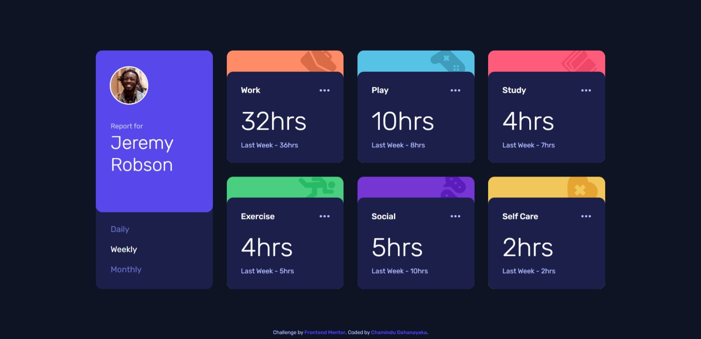

# Frontend Mentor - Time tracking dashboard solution

This is a solution to the [Time tracking dashboard challenge on Frontend Mentor](https://www.frontendmentor.io/challenges/time-tracking-dashboard-UIQ7167Jw). Frontend Mentor challenges help you improve your coding skills by building realistic projects. 

## Table of contents

- [Overview](#overview)
  - [The challenge](#the-challenge)
  - [Screenshot](#screenshot)
  - [Links](#links)
- [My process](#my-process)
  - [Built with](#built-with)
  - [What I learned](#what-i-learned)
  - [Continued development](#continued-development)
- [Author](#author)

## Overview

### The challenge

Users should be able to:

- View the optimal layout for the site depending on their device's screen size
- See hover states for all interactive elements on the page
- Switch between viewing Daily, Weekly, and Monthly stats

### Screenshot



### Links

- Solution URL: [Solution URL here]()
- Live Site URL: [Live site URL here]()

## My process

### Built with

- Semantic HTML5 markup
- Flexbox
- CSS Grid
- Mobile-first workflow

### What I learned

In this project, I learned to use below code snippets:

```css
main{
    display: grid;
    grid-template-areas: 'one' 'two' 'three' 'four' 'five' 'six' 'seven';
    gap: 24px;
}
input[type="radio"]:checked + span{
    color: hsl(0, 0%, 100%);
}
input[type="radio"]:not(:checked) + span{
    color: hsl(235, 45%, 61%);
}
input[type="radio"]:not(:checked) + span:hover{
    color: hsl(0, 0%, 100%);
}
#work-section .image-container{
    background-position: 93% -10px;
}
.stats-container div img:hover{
    filter: brightness(0) invert(100%);
}
```
```js
daily.addEventListener('click', () => {
    dailyStats.forEach(element => {
        element.style.display = 'flex';
    });
    weeklyStats.forEach(element => {
        element.style.display = 'none';
    });
    monthlyStats.forEach(element => {
        element.style.display = 'none';
    });
});
```

### Continued development

I'm looking to improve my CSS & JavaScript knowledge to design more unique and new stuff.

## Author

- Frontend Mentor - [@ChaminduD](https://www.frontendmentor.io/profile/ChaminduD)
- LinkedIn - [Chamindu Dahanayaka](https://www.linkedin.com/in/chamindudahanayaka/)